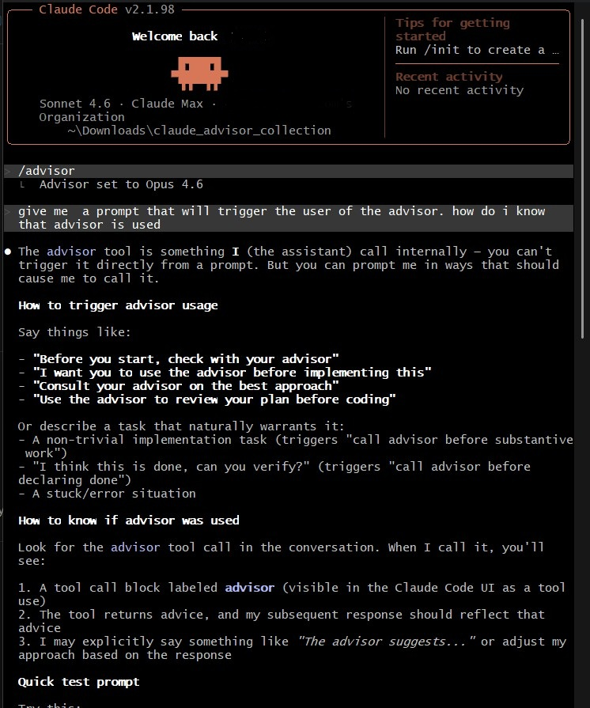
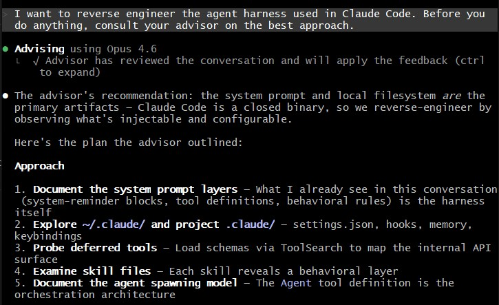

# Claude Advisor

Two ways to use Anthropic's advisor pattern: as a **Claude Code user** invoking Opus mid-task via the `/advisor` skill, and as a **developer** embedding the advisor tool directly in your own agentic application.

---

## 1. The Advisor Strategy in Claude Code

The `/advisor` skill in Claude Code sets Opus 4.6 as a server-side reviewer that Claude consults at key decision points — before writing, before committing to an approach, before declaring done.

You don't call it directly. You prompt Claude in ways that trigger it:

> *"Before you start, check with your advisor."*
> *"Consult your advisor on the best approach."*
> *"I want you to use the advisor before implementing this."*



When the advisor runs, you'll see it in the Claude Code UI as a tool call block labelled **advisor**. Claude's subsequent response reflects the advice.



In the example above, the task was to reverse-engineer Claude Code's agent harness. The advisor reviewed the full conversation and returned a structured 5-step plan (document system prompt layers → explore `.claude/` → probe deferred tools → examine skill files → document agent spawning model). Claude then executed that plan.

The result: the advisor handles strategic planning at Opus intelligence; Claude handles execution at Sonnet speed and cost.

📹 **Demo video:** [watch on GitHub Releases](https://github.com/az9713/claude-advisor/releases/tag/v1.0.0)

---

## 2. The Advisor Tool API — `security_audit_advisor.py`

`security_audit_advisor.py` is a complete, runnable example of the [Advisor Tool API](https://platform.claude.com/docs/en/agents-and-tools/tool-use/advisor-tool) (beta). It runs a security audit on a deliberately vulnerable Python codebase using:

- **Executor**: `claude-haiku-4-5` — runs the agentic loop, reads files, searches for patterns
- **Advisor**: `claude-opus-4-6` — consulted server-side at key decision points (severity, remediation)

Everything happens inside a single `/v1/messages` call per turn. No extra round-trips.

```python
ADVISOR_TOOL = {
    "type": "advisor_20260301",
    "name": "advisor",
    "model": "claude-opus-4-6",
    "max_uses": 3,
    "caching": {"type": "ephemeral", "ttl": "5m"},
}

response = client.beta.messages.create(
    model="claude-haiku-4-5",
    tools=[*CLIENT_SIDE_TOOLS, ADVISOR_TOOL],
    messages=messages,
    betas=["advisor-tool-2026-03-01"],
)
```

The example covers every part of the API surface: `server_tool_use` blocks, `advisor_tool_result` variants, `usage.iterations` per-model billing, `pause_turn` handling, streaming, and batch.

### What it demonstrates

| Feature | Description |
|---------|-------------|
| Advisor tool definition | `type`, `model`, `max_uses`, `caching` |
| Beta API call | `client.beta.messages.create()` + `betas=[]` |
| `server_tool_use` blocks | How the executor signals an advisor call |
| `advisor_tool_result` variants | `advisor_result`, `advisor_redacted_result`, `advisor_tool_result_error` |
| `usage.iterations` | Per-model token accounting via `type` field |
| `pause_turn` | Dangling advisor call handling |
| Streaming | `client.beta.messages.stream()` |
| Batch | Valid single-turn batch with advisor only |
| Cost analysis | Advisor pattern vs Opus-only baseline |

### Cost estimate

For the three-file codebase in this example (two advisor calls, typical):

| | Cost |
|--|------|
| Executor (Haiku, ~4,550 input / ~1,200 output tokens) | ~$0.011 |
| Advisor (Opus, ~3,500 input / ~3,200 output tokens) | ~$0.098 |
| **Total** | **~$0.109** |
| Opus-only equivalent | ~$0.150 |
| Savings | ~27% |

Advisor output tokens (at $25/M) are 73% of the total bill. The executor handles 5 loop turns and 7 tool calls at Haiku rates.

### Run it

```bash
python -m venv .venv
source .venv/Scripts/activate      # Mac/Linux: source .venv/bin/activate
pip install anthropic python-dotenv
echo 'ANTHROPIC_API_KEY="sk-ant-..."' > .env
python security_audit_advisor.py
```

### Documentation

Full docs in [`docs/`](docs/):

| | |
|--|--|
| [What is the advisor tool?](docs/overview/what-is-the-advisor-tool.md) | Mental model, benchmarks, when to use it |
| [Quickstart](docs/getting-started/quickstart.md) | Install and run in 5 minutes |
| [Code walkthrough](docs/walkthrough.md) | Line-by-line tour of the file |
| [Advisor API shapes](docs/concepts/advisor-api-shapes.md) | Every content block type annotated |
| [Agentic loop](docs/concepts/agentic-loop.md) | How the multi-turn loop works |
| [Usage and cost](docs/concepts/usage-and-cost.md) | `usage.iterations`, cost estimate, caching |
| [Streaming variant](docs/guides/streaming-variant.md) | `run_audit_streaming()` |
| [Batch variant](docs/guides/batch-variant.md) | `submit_batch_audit()` |
| [Reference](docs/reference/advisor-tool-reference.md) | Complete field reference, error codes |
| [Troubleshooting](docs/troubleshooting/common-issues.md) | Common errors and fixes |

---

## Further reading

- [The Advisor Strategy](https://claude.com/blog/the-advisor-strategy) — Anthropic blog post
- [Advisor Tool API docs](https://platform.claude.com/docs/en/agents-and-tools/tool-use/advisor-tool) — official reference
